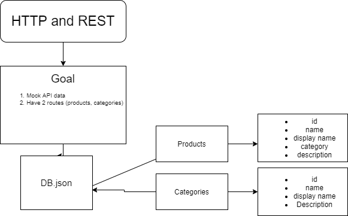

# api-server
API-server for storefronts to use

# notes
API and REST

## Project: REST-API

### Author: Brendon

### Links and Resources

- [submission PR](https://github.com/brendon-401-advanced-javascript/api-server/pull/1)
- [ci/cd](https://github.com/brendon-401-advanced-javascript/api-server/actions) (GitHub Actions)
- [back-end server url](http://xyz.com) (when applicable)
- [front-end application](http://xyz.com) (when applicable)

### User Stories

* As a developer, I want to CREATE a new record in a database, using the POST method on a custom API
* As a developer, I want the API to return the record I create in JSON format
* As a developer, I want to GET list of all records in a database, using the GET method on a custom API
* As a developer, I want the API to return an object containing count, and a results[] array
* As a developer, I want to GET an existing in a database, using the GET method with an ID parameter on a custom API
* As a developer, I want the API to return an object containing the record from the database
* As a developer, I want to UPDATE an existing record in a database, using the PUT and PATCH methods with an ID parameter on a custom API
* As a developer, I want the API to return the record I updated in JSON format
* As a developer, I want to DELETE an existing record in a database, using the DELETE method with an ID parameter on a custom API
* As a developer, I want the API to return the record I updated in JSON format
* As a developer, I want Swagger documentation for this API so that I can make it easier for other developers to use and understand

### Setup

#### `.env` requirements (where applicable)

npm i dotenv and add a .env file to your repo, then set the port to 3000.

#### How to initialize/run your application (where applicable)

--TO RUN THE APPLICATION--
- In the Terminal run 
    -

#### How to use your library (where applicable)

#### Tests

- How do you run tests?
    - 
- Any tests of note?
- Describe any tests that you did not complete, skipped, etc
    - 

#### UML

Link to an image of the UML for your application and response to events

[Return to Directory](##Directory)

test